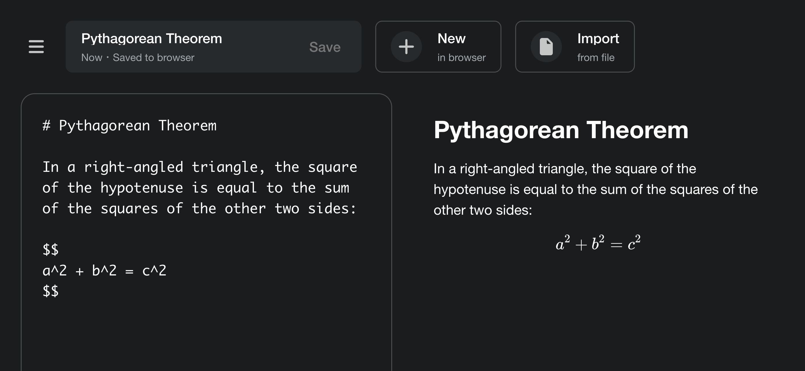

# Notes



Notes is a web-based Markdown editor that supports [LaTeX] math
rendering and syntax highlighting for code blocks.

The content of the note is converted into a [URI fragment], which you
can easily save by bookmarking or share with others. You can also save
your Markdown notes to your browser's [local storage].

## Build

To build the editor using [Bun]:

```sh
bun install
bun run build
bun run preview
```

[LaTeX]: https://www.latex-project.org/
[URI fragment]: https://en.wikipedia.org/wiki/URI_fragment
[local storage]: https://developer.mozilla.org/en-US/docs/Web/API/Web_Storage_API
[Bun]: https://bun.sh/
