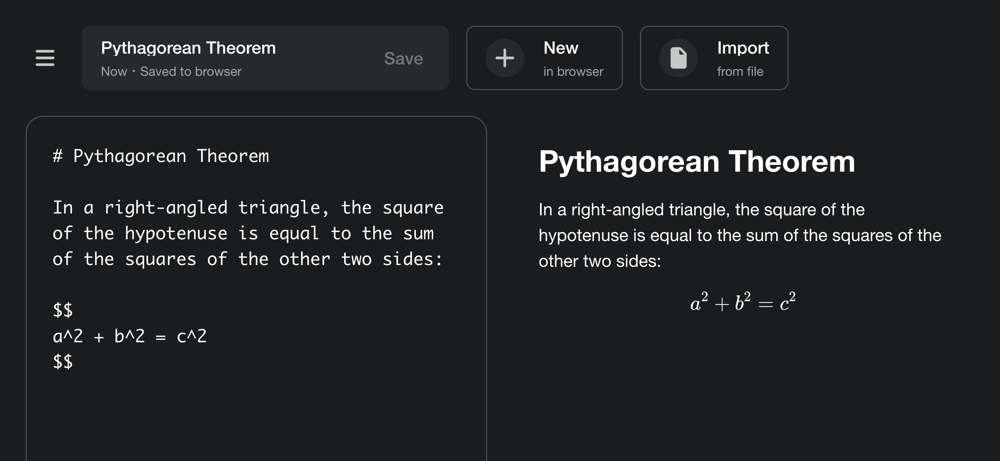

# Markdown Notes



## Overview

This is a web-based Markdown editor, formatter, and previewer with
support for [LaTeX](https://www.latex-project.org/) math formulas. It
automatically formats Markdown documents using
[Prettier](https://prettier.io/), displays previews, and converts them
into [URI fragments](https://en.wikipedia.org/wiki/URI_fragment), making
it easy to save documents quickly by bookmarking or to share them with
others. You can also save your Markdown documents to your browser's
[local
storage](https://developer.mozilla.org/en-US/docs/Web/API/Web_Storage_API).

### Privacy

The app is highly privacy-respecting. No information about the content
of the documents or any other metadata is ever sent to external servers.
We enforce a strict [Content Security Policy
(CSP)](https://developer.mozilla.org/en-US/docs/Web/HTTP/Guides/CSP) to
ensure that no sensitive user data is transmitted to external servers.

### Offline usage

The app automatically caches all core resources to your browser using
the [Service Worker
API](https://developer.mozilla.org/en-US/docs/Web/API/Service_Worker_API),
enabling offline usage.

### Automatic HTML conversion

If you copy a segment of a web page into the clipboard and paste it into
this app, it will automatically convert the content into Markdown and
display the preview.

## Build

To run the app locally:

```sh
bun install
bun run build
bun run preview
```

## Data serialization

If you type your note into the app, the URL will look like this:

```
https://hirokiokada77.github.io/notes/#id=10fe615de58c4e67&text=Note+text+here
```

The data set in the URI fragment is in standard
[URLSearchParams](https://developer.mozilla.org/en-US/docs/Web/API/URLSearchParams)
format, which can be easily parsed using just a few lines of code or
standard third-party tools:

```js
const hash = "#id=10f...&text=Note+text+here";
const query = hash.substring(1);
const params = new URLSearchParams(query);
const noteText = params.get("text");

console.log(noteText); // Output: "Note text here"
```

Here is another example in Python:

```python
from urllib.parse import parse_qs

hash_string = "#id=10f...&text=Note+text+here"
query = hash_string.lstrip('#')
params = parse_qs(query)
note_text = params.get("text")[0]

print(note_text) # Output: "Note text here"
```
