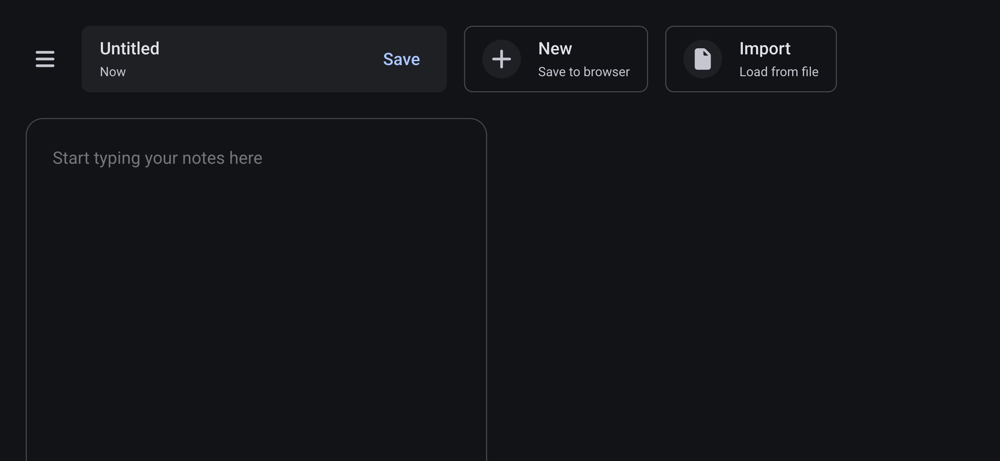

# Notes



Notes is a web-based Markdown editor, formatter, and previewer with
support for syntax highlighting and [LaTeX] math formulas. It
automatically formats Markdown notes using [Prettier], displays
previews, and converts them into [URI fragments], making it easy to save
notes quickly by bookmarking or to share them with others. You can also
save your Markdown notes to your browser's [local storage].

## Features

### Privacy

The app is highly privacy-respecting. No information about the content
of the notes or any other metadata is ever sent to external servers. We
enforce a strict [Content Security Policy (CSP)] to ensure that no
sensitive user data is transmitted to external servers.

### Offline usage

The app automatically caches all core resources to your browser using
the [Service Worker API], enabling offline usage.

### Automatic HTML conversion

If you copy a segment of a web page (including text and images) to the
clipboard and paste it into this app, it will automatically convert the
HTML content into Markdown.

## Build

To run the app locally:

```sh
bun install
bun run build
bun run preview
```

## Data format

If you type your note into the app, the URL will look like this:

```
https://hirokiokada77.github.io/notes/#id=10fe615de58c4e67&text=Note+text+here
```

The data set in the URI fragment is in standard [URLSearchParams]
format, which can be easily parsed using just a few lines of code or
standard third-party tools:

```js
const hash = "#id=10f...&text=Note+text+here";
const query = hash.substring(1);
const params = new URLSearchParams(query);
const noteText = params.get("text");

console.log(noteText); // Output: "Note text here"
```

Below is another example in Python:

```python
from urllib.parse import parse_qs

hash_string = "#id=10f...&text=Note+text+here"
query = hash_string.lstrip('#')
params = parse_qs(query)
note_text = params.get("text")[0]

print(note_text) # Output: "Note text here"
```

[LaTeX]: https://www.latex-project.org/
[Prettier]: https://prettier.io/
[URI fragments]: https://en.wikipedia.org/wiki/URI_fragment
[local storage]: https://developer.mozilla.org/en-US/docs/Web/API/Web_Storage_API
[Content Security Policy (CSP)]: https://developer.mozilla.org/en-US/docs/Web/HTTP/Guides/CSP
[Service Worker API]: https://developer.mozilla.org/en-US/docs/Web/API/Service_Worker_API
[URLSearchParams]: https://developer.mozilla.org/en-US/docs/Web/API/URLSearchParams
